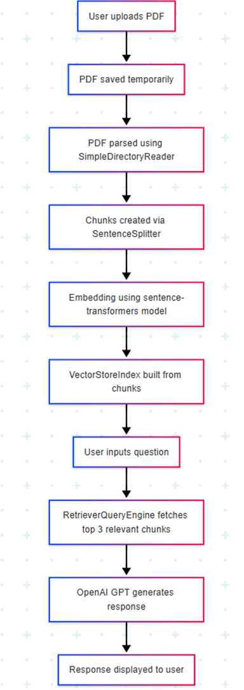

# PolicyDoc QA: Generative Search for Policy Documents

## Project Overview
This project is a robust generative search system that allows users to upload any policy PDF and ask questions about its content. The system uses LlamaIndex for document ingestion, chunking, embedding, and retrieval, and OpenAI's GPT models for answer generation.

## Features
- Upload any PDF policy document
- Automatic text extraction and chunking
- Vector-based semantic search over document content
- Generative answers to user questions using LLMs
- Simple, interactive Streamlit web interface

## System Design


### Workflow
1. User uploads a PDF.
2. The system extracts and chunks the text.
3. Chunks are embedded and indexed in a vector store.
4. User asks a question.
5. The system retrieves relevant chunks and generates an answer using an LLM.

## How to Run
1. Clone this repository.
2. Install dependencies:
   ```bash
   pip install -r requirements.txt
   ```
3. Set your OpenAI API key in a `.env` file:
   ```env
   OPENAI_API_KEY=your_openai_key_here
   ```
4. Start the app:
   ```bash
   streamlit run app.py
   ```
5. Upload a PDF and ask your questions!

## Documentation
- **Project Goals:** Build a robust generative search system for policy documents.
- **Design Choices:** LlamaIndex for ingestion, chunking, embedding, and retrieval; OpenAI LLM for answer generation.
- **Challenges:** Handling large PDFs, efficient chunking, accurate retrieval, and prompt engineering.

## Flowchart

